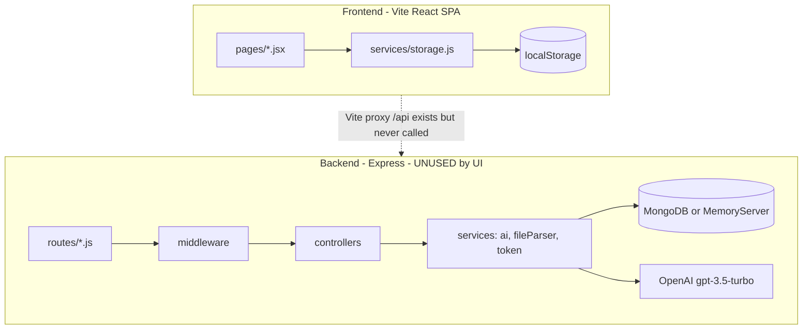
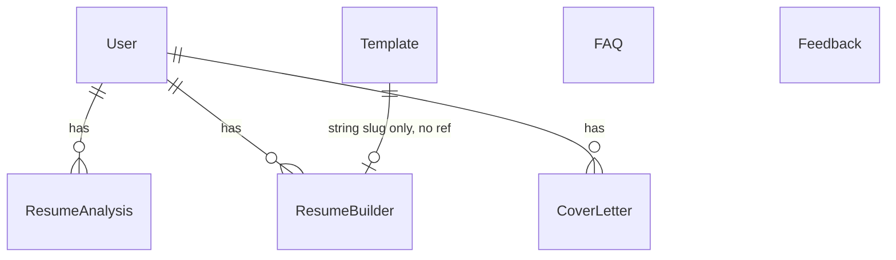
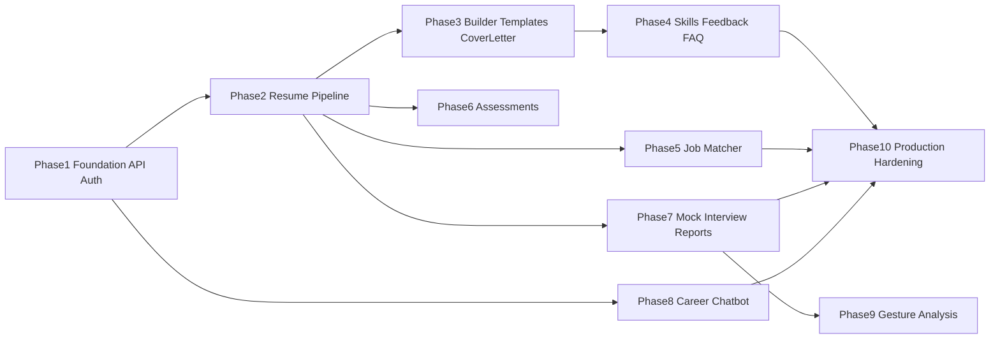

# RESUPREP AUDIT REPORT (Phase 0)

**Verdict:** The product looks complete in the UI, but the frontend never calls the backend. There is **zero** `fetch`/`axios` usage under [`frontend/src`](frontend/src). Persistence is `localStorage`. “AI” on the client is keyword heuristics, string templates, or random mock results. The backend under [`backend/src`](backend/src) is a real Express + Mongo + JWT + OpenAI (with NLP fallbacks) API — but it is an orphaned second system.

**Evidence anchors:**
- Grep of `frontend/src`: no `fetch(`, `axios`, `VITE_API`, or `/api/v1`
- [`frontend/src/services/storage.js`](frontend/src/services/storage.js) line 2: *“No backend needed.”*
- README claims `frontend/src/api/`, gesture/interview services — those folders **do not exist**

---

## 1. Current Architecture

### What actually exists

### Layer map (actual files)

| Layer | Responsibility | Key files |
|-------|----------------|-----------|
| Frontend UI | Routes, pages, charts, theme | [`frontend/src/App.jsx`](frontend/src/App.jsx), [`pages/`](frontend/src/pages), [`components/`](frontend/src/components) |
| Frontend “API” | localStorage + client NLP | [`frontend/src/services/storage.js`](frontend/src/services/storage.js) only — **no `api/` folder** |
| Auth UI | Cosmetic login | [`Login.jsx`](frontend/src/pages/Login.jsx), [`AuthContext.jsx`](frontend/src/context/AuthContext.jsx) (underused), [`useAuth.js`](frontend/src/hooks/useAuth.js) (**unused by pages**) |
| Express app | CORS, helmet, rate limit, mounts | [`backend/src/app.js`](backend/src/app.js), [`server.js`](backend/src/server.js) |
| Routes | `/api/v1/*` | [`backend/src/routes/`](backend/src/routes) |
| Middleware | JWT, upload, Joi, errors | [`middleware/auth.js`](backend/src/middleware/auth.js), [`upload.js`](backend/src/middleware/upload.js), [`validate.js`](backend/src/middleware/validate.js) |
| Controllers | Business entry | [`backend/src/controllers/`](backend/src/controllers) |
| Services | AI, PDF/DOCX, JWT cookie | [`ai.service.js`](backend/src/services/ai.service.js), [`fileParser.service.js`](backend/src/services/fileParser.service.js), [`token.service.js`](backend/src/services/token.service.js) |
| Models | Mongoose | [`backend/src/models/`](backend/src/models) (7 models) |
| External AI | OpenAI if key set | `OPENAI_API_KEY` in [`backend/.env.example`](backend/.env.example) |

**Stack match:** Frontend deps match intended (React 18, Vite, Tailwind, Framer Motion, Chart.js). Backend deps match (Express, Mongoose, JWT, bcrypt, multer, pdf-parse, mammoth, openai). **Integration does not.**

---

## 2. Feature Status Matrix

| Feature | UI | Frontend Logic | API | Backend | Database | AI | Status |
|---------|----|----------------|-----|---------|----------|-----|--------|
| Resume Analyzer | Yes | Client keyword NLP + `Math.random` score | Missing FE client | `POST /resume/analyze` + history | `ResumeAnalysis` | Real OpenAI **or** fallback | **PARTIAL** (BE real, FE disconnected/mocked) |
| Job Matcher | Yes | Hardcoded `mockJobs` + random match % | None | None | None | None | **MOCKED** |
| ATS Resume Builder | Yes | Live form + html2pdf; no save API | Missing FE | Builder CRUD | `ResumeBuilder` | N/A | **PARTIAL** (PDF export works client-side; no BE persistence from UI) |
| Cover Letter | Yes | Tone string templates | Missing FE | Generate + CRUD | `CoverLetter` | Real OpenAI **or** template fallback | **PARTIAL** |
| CV Templates | Yes | Hardcoded 8 templates → Builder state | Missing FE | List/get by slug | `Template` + seed | N/A | **PARTIAL** (UI static; BE seeded but unused) |
| Skill Gap Analysis | Yes | Fully static charts/tables | Missing FE | Taxonomy + gap-analysis | None (hardcoded taxonomy) | Real OpenAI **or** fallback | **STATIC** (UI) / BE orphaned |
| Skill Assessment | Yes | Hardcoded MCQ banks, client score | None | None | None | None | **STATIC** |
| AI Mock Interview | Yes | Upload UI + `setTimeout` + random `mockResults` | None | None | None | None | **MOCKED** |
| Gesture and Confidence | Marketing only | Fake loading messages inside Mock Interview | None | None | None | None | **MISSING** |
| Interview Performance Report | Same page as mock interview | Random canned strengths/mistakes | None | None | None | None | **MOCKED** |
| AI Career Assistant | Floating chatbot | Keyword `knowledgeBase` + fake typing delay | None | None | None | None | **MOCKED** |
| Auth / User System | Login UI | Password ignored; localStorage user | Missing FE | JWT signup/login/me | `User` | N/A | **PARTIAL** (BE WORKING if called; FE MOCKED) |
| Dark/Light mode | Yes | `localStorage.theme` | N/A | N/A | N/A | N/A | **WORKING** |
| FAQ | Yes | Hardcoded `faqData` | Missing FE | `GET /faqs` | `FAQ` | N/A | **STATIC** (UI) |
| Feedback | Yes | localStorage + seeded reviews | Missing FE | Create + public list | `Feedback` | N/A | **PARTIAL** |
| Protected routes | No | None | — | `protect` on some routes | — | — | **MISSING** (FE) |
| Analysis history UI | Thin | localStorage history helpers | — | History CRUD | Yes | — | **PARTIAL** |

Status rule applied: nothing marked WORKING unless full FE→BE→DB chain is verified. Dark mode is the main fully working end-to-end client feature.

---

## 3. Static / Fake Functionality Report

### Feature: Frontend ↔ Backend connection
- **File(s):** Entire `frontend/src`; [`vite.config.js`](frontend/vite.config.js) unused proxy; [`frontend/.env.example`](frontend/.env.example) unused `VITE_API_URL`
- **What happens:** App runs entirely in-browser
- **Why not functional:** No HTTP client; README `api/` folder absent
- **Real implementation:** Axios/fetch API module, credentials/cookies or Bearer token, wire every page to `/api/v1`

### Feature: Authentication
- **File(s):** [`storage.js`](frontend/src/services/storage.js) `loginUser`/`signupUser`; [`Login.jsx`](frontend/src/pages/Login.jsx)
- **What happens:** Any email/password stores `{id, email, name}`; password discarded
- **Why not functional:** No bcrypt, no JWT, no `/auth/*` calls; `useAuth` unused
- **Real implementation:** Call backend auth; store token/cookie; ProtectedRoute; sync AuthContext

### Feature: Resume Analyzer (UI path)
- **File(s):** [`Analyzer.jsx`](frontend/src/pages/Analyzer.jsx), [`storage.js`](frontend/src/services/storage.js) `analyzeResume`
- **What happens:** Text/upload → keyword overlap + random score jitter; rotating “NLP” messages; history in localStorage
- **Why not functional:** Uses `file.text()` (PDF/DOCX binary will not extract properly); ignores backend `fileParser` + OpenAI
- **Real implementation:** `FormData` to `POST /api/v1/resume/analyze`; render `result`; load history from BE when logged in

### Feature: Job Matcher
- **File(s):** [`Jobs.jsx`](frontend/src/pages/Jobs.jsx), [`JobCard.jsx`](frontend/src/components/JobCard.jsx)
- **What happens:** `setTimeout(1200)` → shuffle hardcoded jobs → jitter `matchPercent`; View/Apply do nothing
- **Why not functional:** No job data source, no skill extraction, no match engine
- **Real implementation:** Job model/API or external jobs API + match service using resume skills

### Feature: Cover Letter
- **File(s):** [`CoverLetter.jsx`](frontend/src/pages/CoverLetter.jsx)
- **What happens:** Interpolated string templates by tone; client PDF; does not call `saveCoverLetter` helpers
- **Why not functional:** Not OpenAI; not persisted to Mongo
- **Real implementation:** `POST /cover-letter/generate` + history UI

### Feature: Skill Gap page
- **File(s):** [`Skills.jsx`](frontend/src/pages/Skills.jsx)
- **What happens:** Fixed `skillData` / radar / courses; print only
- **Why not functional:** No user skills input; ignores `POST /skills/gap-analysis`
- **Real implementation:** Form + taxonomy API + chart from response

### Feature: Skill Assessment
- **File(s):** [`Assessment.jsx`](frontend/src/pages/Assessment.jsx)
- **What happens:** 5 static tracks × 5 MCQs; score in component state
- **Why not functional:** No persistence, no recommendations API, no attempt history
- **Real implementation:** Question bank model, attempt model, scoring endpoint

### Feature: Mock Interview + Performance Report + Gesture
- **File(s):** [`MockInterview.jsx`](frontend/src/pages/MockInterview.jsx)
- **What happens:** Accept media file visually → 6s fake progress → random pick from `mockResults` (score, strengths, mistakes)
- **Why not functional:** File never processed; no questions/answers loop; no CV/eye-contact code anywhere in repo
- **Real implementation:** Session model, AI questions, answer evaluation; gesture is a separate hard CV/ML project (MediaPipe etc.) — currently **MISSING**

### Feature: Career Chatbot “Vio”
- **File(s):** [`Chatbot.jsx`](frontend/src/components/Chatbot.jsx)
- **What happens:** Keyword map replies + random delay
- **Why not functional:** Not LLM; not context-aware of user resume
- **Real implementation:** Chat endpoint with OpenAI + user context; rate limits

### Feature: Templates / FAQ / Feedback (partially)
- Templates: hardcoded FE vs seeded `Template` model — disconnected
- FAQ: hardcoded FE vs `GET /faqs` — disconnected
- Feedback: localStorage + defaults vs `POST /feedback` — disconnected

### Feature: Resume Builder save
- **File(s):** [`Builder.jsx`](frontend/src/pages/Builder.jsx); unused `saveBuiltResume` in storage
- **What happens:** Edit + live preview + html2pdf works locally; refresh loses data unless user exported PDF
- **Real implementation:** Wire builder CRUD endpoints

---

## 4. Backend/API Audit

Base: `/api/v1` ([`app.js`](backend/src/app.js))

### Auth
| Route | Controller | Auth | DB | Behavior | FE consumer | Status |
|-------|------------|------|-----|----------|-------------|--------|
| POST `/auth/signup` | auth.signup | Public + Joi | User | Hash password, JWT + cookie | None | Orphaned WORKING |
| POST `/auth/login` | auth.login | Public + Joi | User | Compare bcrypt, JWT | None | Orphaned WORKING |
| POST `/auth/logout` | auth.logout | Public | — | Clear cookie | None | Orphaned WORKING |
| GET `/auth/me` | auth.getMe | protect | User | Current user | None | Orphaned WORKING |
| PUT `/auth/change-password` | auth.changePassword | protect + Joi | User | Re-hash, re-issue JWT | None | Orphaned WORKING |

### Resume
| Route | Auth | DB | Behavior | FE | Status |
|-------|------|-----|----------|----|--------|
| POST `/resume/analyze` | optionalAuth + multer | ResumeAnalysis | Parse PDF/DOCX or text + JD → AI/fallback → save | None (FE uses storage) | Orphaned WORKING |
| GET/DELETE `/resume/history`… | protect | ResumeAnalysis | User-scoped history | None | Orphaned WORKING |

### Builder / Cover letter / Templates / Skills / FAQ / Feedback / Dashboard
- Builder CRUD (`optionalAuth` on create) → `ResumeBuilder` — **orphaned**
- Cover letter generate + CRUD → `CoverLetter` + AI — **orphaned**
- Templates GET — **orphaned** (seed populates)
- Skills taxonomy (hardcoded in controller) + gap-analysis AI — **orphaned**
- FAQs GET — **orphaned**
- Feedback POST + public GET — **orphaned**
- GET `/dashboard/` — **no auth**; exposes global counts + recent analyses — **SECURITY issue**
- GET `/api/health`, `/api/docs` — present

### APIs that should exist but do not
- Job listings / job match
- Skill assessment questions and attempts
- Mock interview sessions / Q&A / evaluation
- Gesture/confidence analysis
- Career chatbot / conversation history
- User profile update (beyond password)
- User-scoped dashboard (vs global public stats)

---

## 5. Database Audit

### Existing models and relationships

| Model | Role | Notes |
|-------|------|-------|
| [`User`](backend/src/models/User.js) | Auth | bcrypt pre-save; role user/admin |
| [`ResumeAnalysis`](backend/src/models/ResumeAnalysis.js) | Analyzer results | user nullable |
| [`ResumeBuilder`](backend/src/models/ResumeBuilder.js) | Saved resumes | `template` is string, not ObjectId |
| [`CoverLetter`](backend/src/models/CoverLetter.js) | Letters | tone enum |
| [`Template`](backend/src/models/Template.js) | Catalog | seeded; unused by FE |
| [`FAQ`](backend/src/models/FAQ.js) | FAQs | seed uses `mock-interview` category **not in schema enum** (UNVERIFIED at runtime whether those seed docs fail) |
| [`Feedback`](backend/src/models/Feedback.js) | Reviews | no User ref |

### Missing for intended product
- Job / JobMatch
- AssessmentQuestion / AssessmentAttempt
- InterviewSession / InterviewAnswer / InterviewReport
- GestureAnalysis (or embedded report fields)
- ChatConversation / ChatMessage
- Possibly UserProfile / skills inventory

**DB caveat:** [`config/db.js`](backend/src/config/db.js) falls back to **MongoMemoryServer** if `MONGO_URI` fails — data evaporates on restart.

---

## 6. AI Integration Audit

| Location | Classification | Input | Expected output | Flags |
|----------|----------------|-------|-----------------|-------|
| [`ai.service.js`](backend/src/services/ai.service.js) `analyzeResume` | **REAL AI CALL** if key set; else **FALLBACK NLP** | Full resume + JD text | JSON score/keywords/gaps/tips/summary | Sends full resume to OpenAI (privacy/cost); `JSON.parse` on model output can throw → caught → fallback; `Math.random` in fallback score |
| `generateCoverLetter` | **REAL** or **FALLBACK** template | Name, role, company, skills, tone | Letter string | Temperature 0.7; no structured validation |
| `analyzeSkillGap` | **REAL** or **FALLBACK** hardcoded maps | skills[] + targetRole | gaps JSON | Same key dependency |
| FE `storage.analyzeResume` | **FALLBACK NLP** (always) | Same | Same shape + extra `interviewQuestions` | Never hits OpenAI |
| FE CoverLetter | **STATIC OUTPUT** | Form fields | Template string | — |
| FE Chatbot | **MOCKED AI** | Keywords | Canned replies | — |
| FE MockInterview | **MOCKED AI** | None (ignores file) | Random canned report | — |
| Gesture / TF-IDF (About claims) | **MISSING** | — | — | Marketing only |

Unsafe/unreliable notes: no per-user AI rate limit beyond global 200/15min; no prompt-injection hardening; no response schema validation on AI JSON; expensive if long resumes repeatedly analyzed.

---

## 7. Authentication and Security Audit

| Issue | Severity | Evidence |
|-------|----------|----------|
| Frontend auth is fake; password never checked | **CRITICAL** | [`storage.js`](frontend/src/services/storage.js) |
| Dashboard API public — leaks aggregate + recent analysis metadata | **HIGH** | [`dashboard.controller.js`](backend/src/controllers/dashboard.controller.js), no `protect` |
| JWT_SECRET placeholder in `.env.example`; production risk if unchanged | **HIGH** | [`.env.example`](backend/.env.example) |
| OpenAI key in env (good) but FE never uses BE — key unused in practice | **MEDIUM** | Architecture |
| Anonymous analyze/builder/cover-letter can write DB with `user: null` | **MEDIUM** | optionalAuth design |
| No token blacklist on logout | **LOW** | Cookie clear only |
| Multer 5MB PDF/DOCX memory upload — OK; no virus scan | **LOW** | [`upload.js`](backend/src/middleware/upload.js) |
| Global rate limit only (not AI-specific) | **MEDIUM** | [`app.js`](backend/src/app.js) |
| CORS + helmet + mongoSanitize + Joi on many routes | Positive | Present |
| Password hashing bcrypt cost 12 | Positive | User model |
| No FE protected routes | **HIGH** (product) | [`App.jsx`](frontend/src/App.jsx) all public |

---

## 8. Frontend Integration Audit

| Issue | Files |
|-------|-------|
| No API layer at all | Missing `frontend/src/api/` |
| Login bypasses AuthContext (`window.location.href`) | [`Login.jsx`](frontend/src/pages/Login.jsx) |
| `useAuth` never imported by pages | [`hooks/useAuth.js`](frontend/src/hooks/useAuth.js) |
| Jobs View/Apply dead | [`JobCard.jsx`](frontend/src/components/JobCard.jsx) |
| Fake loaders (Jobs 1.2s, MockInterview 6s, Chatbot typing) | Those pages/components |
| Builder/CoverLetter don’t use their storage save helpers | Builder, CoverLetter |
| Skills/Assessment/Templates/FAQ fully or mostly static | respective pages |
| Endpoint mismatch N/A — FE doesn’t call anything | — |
| About/FAQ overclaim OpenAI, TF-IDF, Node/Mongo for the running UI | [`About.jsx`](frontend/src/pages/About.jsx), [`FAQ.jsx`](frontend/src/pages/FAQ.jsx) |

---

# IMPLEMENTATION ROADMAP

Ordered by **actual repo dependencies** (wire what exists before building greenfield features).

---

### Phase 1: Foundation — API Client + Real Auth

**Goal:** Frontend talks to Express; JWT login/signup/logout/me works; protected UI routes.

**Why now:** Every user-specific feature depends on real identity. Backend auth already exists.

**Reuse:** [`auth.routes.js`](backend/src/routes/auth.routes.js), [`token.service.js`](backend/src/services/token.service.js), [`AuthContext.jsx`](frontend/src/context/AuthContext.jsx), Vite proxy, `VITE_API_URL`.

**Fix:** Replace localStorage auth; wire Login to AuthContext; cookie/credentials or Bearer.

**FE work:** Create `src/api/client.js` + `auth.js`; ProtectedRoute; fix Navbar user source; stop calling `loginUser`/`signupUser`.

**BE work:** Minimal (verify cookie `credentials: true`); optionally fail fast if `JWT_SECRET` is placeholder.

**DB:** None. **AI:** None.

**Important files:** AuthContext, Login, Navbar, auth controller/routes, token.service, vite.config, env examples.

**New files:** `frontend/src/api/client.js`, `frontend/src/api/auth.js`, `ProtectedRoute.jsx`.

**Concepts:** JWT httpOnly cookies vs Bearer; CORS credentials; AuthProvider bootstrap via `/auth/me`.

**Verify:** Signup → login → `/auth/me` → refresh keeps session → logout. Wrong password rejected.

**DoD:** Fake `loginUser` unused for auth; password validated server-side; protected routes redirect to `/login`.

**Deps:** None. **Difficulty:** Medium.

---

### Phase 2: Resume Pipeline (Analyzer + History + File Parse)

**Goal:** Analyzer uses `POST /resume/analyze` with PDF/DOCX/text; history from Mongo when logged in.

**Why now:** Core product; backend already has multer + fileParser + AI/fallback.

**Reuse:** resume controller, fileParser, ai.service, Analyzer UI/charts.

**Fix:** Remove FE-only `analyzeResume` as primary path; real multipart upload; network loading/error states.

**Verify:** Upload PDF against JD → score from API; history list after login.

**DoD:** No `file.text()` for PDF; OpenAI or documented fallback only via backend.

**Deps:** Phase 1 (for history). **Difficulty:** Medium.

---

### Phase 3: Builder + Templates + Cover Letter

**Goal:** Templates from API; builder save/load; cover letter generate via AI endpoint; keep client PDF export.

**Reuse:** Builder/CoverLetter/Templates pages; builder, coverLetter, template controllers/models.

**Fix:** Replace hardcoded templates; persist drafts; call generate API.

**Deps:** Phase 1. **Difficulty:** Medium.

---

### Phase 4: Skills Gap + FAQ + Feedback (wire existing BE)

**Goal:** Skills page interactive against `/skills/*`; FAQ/Feedback use APIs.

**Reuse:** skill.controller taxonomy + AI gap; faq/feedback controllers; RadarChart/SkillBar.

**Fix:** Static Skills.jsx; local FAQ/feedback stores.

**Deps:** Phase 1 helpful for identity. **Difficulty:** Easy–Medium.

---

### Phase 5: Job Matcher (new backend)

**Goal:** Real match % from resume skills vs job requirements (seeded jobs or pasted JD).

**Why later:** No backend exists; needs resume skills from Phase 2.

**New:** Job model/routes/service; rewrite Jobs.jsx.

**Deps:** Phase 2. **Difficulty:** Hard.

---

### Phase 6: Skill Assessment (new backend)

**Goal:** Persist question banks, attempts, history, recommendations.

**New:** Assessment models/APIs; upgrade Assessment.jsx.

**Deps:** Phase 1. **Difficulty:** Medium.

---

### Phase 7: Mock Interview + Performance Report (new backend)

**Goal:** Role + type → AI questions → answers → evaluation → stored report (text-first; no gesture yet).

**Replace:** Entire mockResults/`setTimeout` flow.

**Deps:** Phase 1–2. **Difficulty:** Hard.

---

### Phase 8: AI Career Assistant

**Goal:** Real chatbot endpoint with rate limits + optional resume context.

**Replace:** Keyword Chatbot.jsx.

**Deps:** Phase 1–2 ideal. **Difficulty:** Medium.

---

### Phase 9: Gesture and Confidence Analysis

**Goal:** Webcam/client CV signals integrated into interview report.

**Why last among features:** **Zero code exists**; highest research risk (browser ML, privacy, accuracy).

**Deps:** Phase 7. **Difficulty:** Very Hard.

---

### Phase 10: Production Hardening

**Goal:** Protect dashboard; AI rate limits; env validation; remove memory-DB surprise; FAQ seed/schema fix; honest About/FAQ copy; remove dead localStorage auth paths.

**Deps:** After core wiring. **Difficulty:** Medium.

---

## CODE I MUST UNDERSTAND (~20%)

1. [`backend/src/app.js`](backend/src/app.js) — middleware order, route mounts
2. [`backend/src/middleware/auth.js`](backend/src/middleware/auth.js) + [`token.service.js`](backend/src/services/token.service.js) — JWT contract
3. [`backend/src/services/ai.service.js`](backend/src/services/ai.service.js) — real vs fallback AI
4. [`backend/src/services/fileParser.service.js`](backend/src/services/fileParser.service.js) + [`upload.js`](backend/src/middleware/upload.js) — resume files
5. [`backend/src/controllers/resume.controller.js`](backend/src/controllers/resume.controller.js) — canonical feature pipeline pattern
6. [`backend/src/models/User.js`](backend/src/models/User.js) + [`ResumeAnalysis.js`](backend/src/models/ResumeAnalysis.js) — data shape
7. [`backend/src/validators/schemas.js`](backend/src/validators/schemas.js) — request contracts
8. [`frontend/src/App.jsx`](frontend/src/App.jsx) — routes
9. [`frontend/src/context/AuthContext.jsx`](frontend/src/context/AuthContext.jsx) — where real auth must plug in
10. [`frontend/src/services/storage.js`](frontend/src/services/storage.js) — what you will retire/replace
11. [`frontend/src/pages/Analyzer.jsx`](frontend/src/pages/Analyzer.jsx) — first page to rewire
12. [`frontend/vite.config.js`](frontend/vite.config.js) + env examples — how FE reaches BE

**Concepts:** JWT cookies vs Bearer; multipart `FormData`; Mongoose refs; OpenAI chat completions + deterministic fallbacks; separating UI mock from API truth.

---

## CODE I CAN MOSTLY TREAT AS IMPLEMENTATION DETAIL

- Chart/presentation: ScoreChart, RadarChart, SkillBar, JobCard, TemplateCard, ReviewCard
- Marketing/static chrome: Home, About, Footer, Navbar styling, globals.css
- Swagger config, winston logger, apiResponse helpers (use as patterns, don’t memorize)
- Seed script contents (except knowing templates/FAQs are seeded)
- Hardcoded mock blobs inside Jobs/MockInterview/Assessment/Skills (replace later)
- Framer Motion / Tailwind utility usage

---

## Recommended Starting Point

**Start with Phase 1: Foundation — API Client + Real Auth.**

Why: The largest architectural break is the FE/BE disconnect. Backend auth, models, and AI routes already exist; building more UI mocks wastes effort. Once auth and an `api/` client work, Phase 2 (Resume Analyzer) becomes a straight wiring job against proven controllers — the highest learning ROI for a MERN student.

**STOP.** No code changes until you explicitly approve Phase 1.

## CURRENT PROJECT STATUS

Current Phase:
Phase 1 — Foundation (API Client + Real Authentication)

Current Checkpoint:
Checkpoint 3 — AuthContext Integration (Completed ✅)

Completed:
- Repository Audit ✅
- Architecture Review ✅
- Implementation Roadmap ✅
- Checkpoint 1: Backend Authentication Verification ✅
- Checkpoint 2: Frontend API Client Setup (src/api/client.js & src/api/auth.js) ✅
- Checkpoint 3: AuthContext Integration (frontend/src/context/AuthContext.jsx) ✅

Next Task:
Checkpoint 4: Wire Login & Signup UI Pages to AuthContext / Real API

Last Completed Commit:
Pending user commit approval (Suggested: "feat(auth): refactor AuthContext to use real backend API and handle session bootstrap")

Current Branch:
main